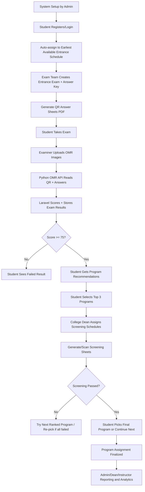
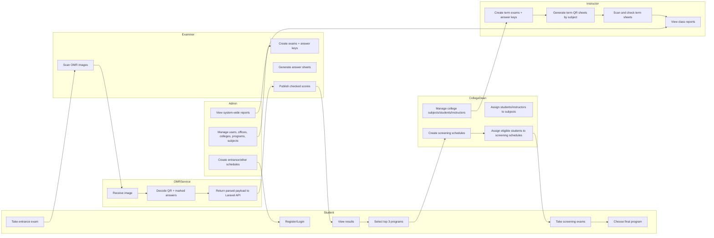
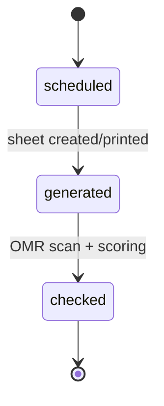
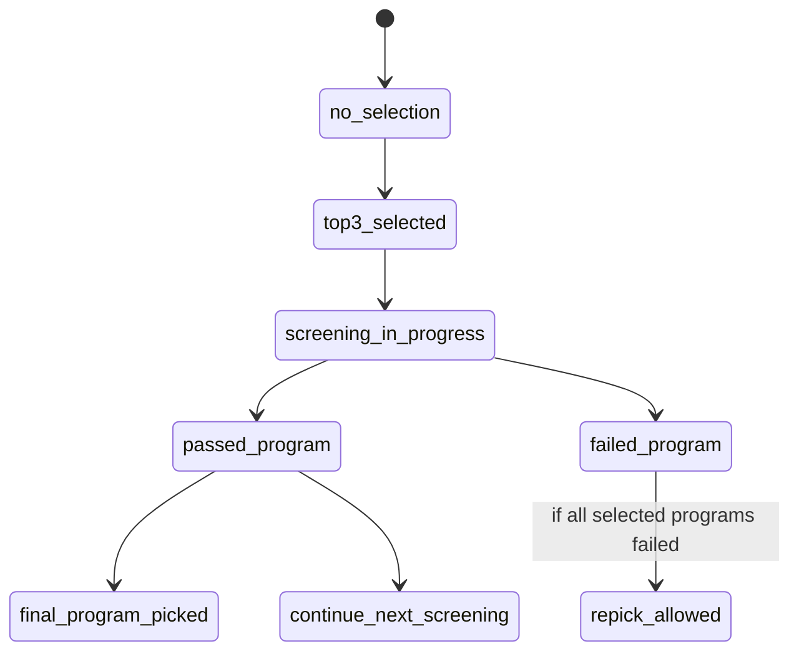

# EduAssess System Workflow

## 1) End-to-End Workflow (Whole System)

## 2) Role Swimlane Workflow

## 3) Core Operational Phases

1. Foundation Setup
- Admin configures master data: users, colleges/departments, offices, programs, program requirements, subjects, and schedules.

2. Authentication and Access
- Users authenticate via Sanctum token (`/api/login`).
- Role-based routing grants access to `admin`, `college_dean`, `entrance_examiner`, and `instructor` modules.
- Student operations are API-driven (registration, schedules, reports, recommendations).

3. Entrance Exam Lifecycle
- Student registration auto-books the earliest available entrance schedule.
- Examiner/dean/instructor can create exams and answer keys.
- Answer sheets are generated with QR payloads and printed as PDFs.
- After exam, OMR scan checks sheets and stores:
  - `answer_sheets.status = checked`
  - `answer_sheets.total_score`
  - subject scores in `exam_results`

4. Recommendation and Screening Lifecycle
- If entrance score is passing (`>= 75`), student can open recommendations.
- System computes qualified programs using `program_requirements` weighted by subject scores.
- Student selects top 3 ranked programs (`recommendations.type = student_choice`).
- Deans schedule and assign eligible students to screening exam slots.
- Screening results enforce progression rules:
  - Pass rank N: student decides `pick` final program or `continue` to higher rank.
  - Fail: move to next ranked option.
  - Fail all selected programs: repick flow opens.

5. Instructor Term Exam Lifecycle
- Instructor creates term exam and subject mappings.
- Instructor generates subject-based QR sheets for assigned students.
- Instructor scans via term OMR endpoint; scores are stored similarly in answer sheets/exam results.

6. Reporting and Monitoring
- Admin: users, activities, scheduled students, exam reports.
- College Dean/Instructor/Entrance: exam result reports and analysis views.
- Student: personal checked results and recommendation state.

## 4) Main Data Objects and State Transitions

### Key Entities
- `users` (roles)
- `students`, `employees`
- `exams`, `exam_subjects`, `answer_keys`
- `exam_schedules`, `student_exam_schedules`
- `answer_sheets`, `exam_results`
- `programs`, `program_requirements`, `recommendations`

### Common State Transitions

## 5) API-Level Workflow Map (Simplified)

1. Auth + Profile
- `/api/login`, `/api/register`, `/api/logout`, `/api/profile/*`

2. Exam Authoring and Sheets
- `/api/exams`
- `/api/answer-keys`
- `/api/answer-sheets`
- `/api/answer-sheets/generate`
- `/api/answer-sheets/generate-term`

3. OMR Checking
- Entrance/screening: `/api/entrance/omr/check`
- Term exam: `/api/instructor/omr/check-term`

4. Scheduling and Assignment
- Admin: `/api/admin/exam-schedules`
- Dean screening schedules + assignments:
  - `/api/college_dean/screening-schedules`
  - `/api/college_dean/screening-schedules/assign-students`

5. Recommendations and Student Decisions
- `/api/student/program-recommendations`
- `/api/student/program-recommendations/select`
- `/api/student/program-recommendations/decision`

6. Reports
- Admin reports: `/api/admin/*`
- Entrance reports: `/api/entrance/reports/*`
- Student reports: `/api/student/reports`

---

This workflow is based on the current controllers/routes in this repository and can be used directly for thesis documentation, onboarding, or architecture reviews.
